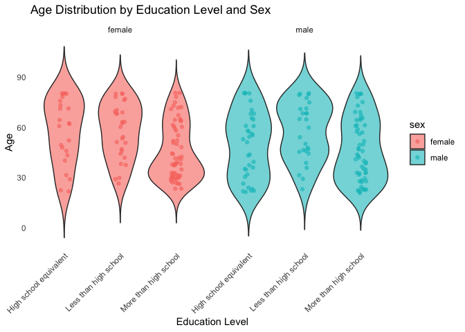
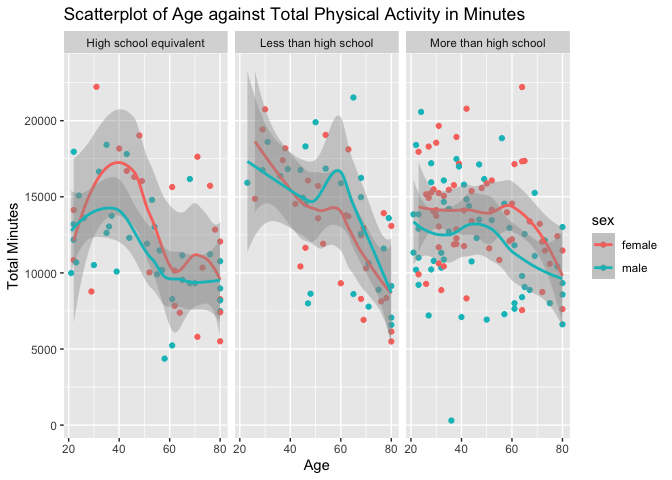
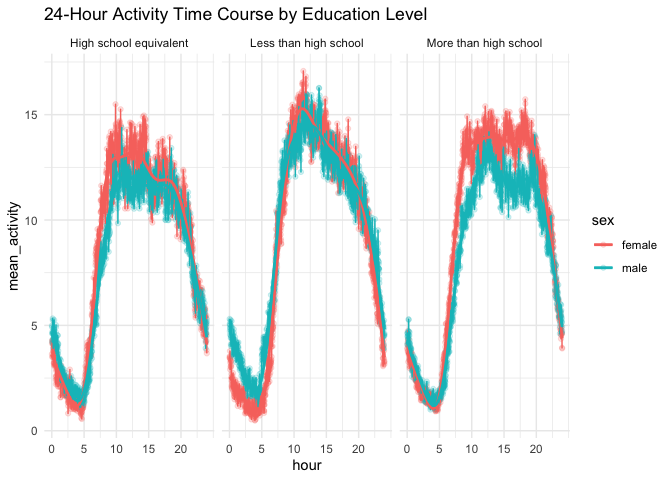
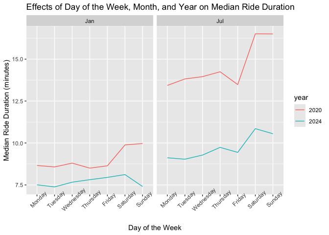
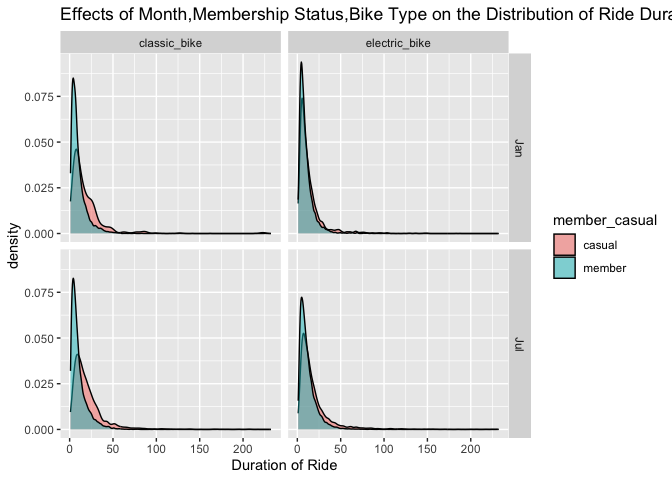

p8105_hw3_xw2961
================
`Oct 16`

\#load packages

``` r
library(tidyverse)
```

    ## ── Attaching core tidyverse packages ──────────────────────── tidyverse 2.0.0 ──
    ## ✔ dplyr     1.1.4     ✔ readr     2.1.5
    ## ✔ forcats   1.0.0     ✔ stringr   1.5.1
    ## ✔ ggplot2   3.5.1     ✔ tibble    3.2.1
    ## ✔ lubridate 1.9.3     ✔ tidyr     1.3.1
    ## ✔ purrr     1.0.2     
    ## ── Conflicts ────────────────────────────────────────── tidyverse_conflicts() ──
    ## ✖ dplyr::filter() masks stats::filter()
    ## ✖ dplyr::lag()    masks stats::lag()
    ## ℹ Use the conflicted package (<http://conflicted.r-lib.org/>) to force all conflicts to become errors

``` r
library(dplyr)
library(readr)
library(ggplot2)
```

### Problem 2

``` r
# dataset loading, tidy, merge
demographic = read_csv("./data/nhanes_covar.csv") %>%
  {colnames(.) <- as.character(.[4, ]); .} %>%  # Set 4th row as column names
  slice(-c(1:4)) %>%                            # Remove the first four rows
  janitor::clean_names() %>% 
  filter(age >= 21) %>%                        
  mutate(sex = recode(sex, "1" = "male", "2" = "female")) %>%  
  mutate(education = recode(education,         
                            "1" = "Less than high school", 
                            "2" = "High school equivalent", 
                            "3" = "More than high school")) %>% 
  drop_na() %>% 
  mutate(age = as.numeric(age)) %>% 
  mutate(bmi = as.numeric(bmi))
```

    ## New names:
    ## Rows: 254 Columns: 5
    ## ── Column specification
    ## ──────────────────────────────────────────────────────── Delimiter: "," chr
    ## (5): ...1, 1 = male, ...3, ...4, 1 = Less than high school
    ## ℹ Use `spec()` to retrieve the full column specification for this data. ℹ
    ## Specify the column types or set `show_col_types = FALSE` to quiet this message.
    ## • `` -> `...1`
    ## • `` -> `...3`
    ## • `` -> `...4`

``` r
demographic
```

    ## # A tibble: 228 × 5
    ##    seqn  sex      age   bmi education             
    ##    <chr> <chr>  <dbl> <dbl> <chr>                 
    ##  1 62161 male      22  23.3 High school equivalent
    ##  2 62164 female    44  23.2 More than high school 
    ##  3 62169 male      21  20.1 High school equivalent
    ##  4 62174 male      80  33.9 More than high school 
    ##  5 62177 male      51  20.1 High school equivalent
    ##  6 62178 male      80  28.5 High school equivalent
    ##  7 62180 male      35  27.9 More than high school 
    ##  8 62184 male      26  22.1 High school equivalent
    ##  9 62189 female    30  22.4 More than high school 
    ## 10 62199 male      57  28   More than high school 
    ## # ℹ 218 more rows

``` r
accelerometers = read_csv("./data/nhanes_accel.csv") %>% 
  janitor::clean_names() %>% 
  mutate(seqn=as.character(seqn))
```

    ## Rows: 250 Columns: 1441
    ## ── Column specification ────────────────────────────────────────────────────────
    ## Delimiter: ","
    ## dbl (1441): SEQN, min1, min2, min3, min4, min5, min6, min7, min8, min9, min1...
    ## 
    ## ℹ Use `spec()` to retrieve the full column specification for this data.
    ## ℹ Specify the column types or set `show_col_types = FALSE` to quiet this message.

``` r
accelerometers
```

    ## # A tibble: 250 × 1,441
    ##    seqn   min1  min2  min3  min4   min5   min6  min7   min8    min9  min10
    ##    <chr> <dbl> <dbl> <dbl> <dbl>  <dbl>  <dbl> <dbl>  <dbl>   <dbl>  <dbl>
    ##  1 62161 1.11  3.12  1.47  0.938 1.60   0.145  2.10  0.509   1.63   1.20  
    ##  2 62164 1.92  1.67  2.38  0.935 2.59   5.22   2.39  4.90    1.97   3.13  
    ##  3 62169 5.85  5.18  4.76  6.48  6.85   7.24   6.12  7.48    5.47   6.49  
    ##  4 62174 5.42  3.48  3.72  3.81  6.85   4.45   0.561 1.61    0.698  2.72  
    ##  5 62177 6.14  8.06  9.99  6.60  4.57   2.78   7.10  7.25   10.1    7.49  
    ##  6 62178 0.167 0.429 0.131 1.20  0.0796 0.0487 0.106 0.0653  0.0564 0.0639
    ##  7 62180 0.039 0     0     0     0.369  0.265  0.506 0.638   0      0.011 
    ##  8 62184 1.55  2.81  3.86  4.76  6.10   7.61   4.74  6.73    5.42   4.24  
    ##  9 62186 3.08  2.54  2.63  2.12  1.14   1.68   2.84  2.72    2.13   2.18  
    ## 10 62189 2.81  0.195 0.163 0     0.144  0.180  0.870 0.214   0      0     
    ## # ℹ 240 more rows
    ## # ℹ 1,430 more variables: min11 <dbl>, min12 <dbl>, min13 <dbl>, min14 <dbl>,
    ## #   min15 <dbl>, min16 <dbl>, min17 <dbl>, min18 <dbl>, min19 <dbl>,
    ## #   min20 <dbl>, min21 <dbl>, min22 <dbl>, min23 <dbl>, min24 <dbl>,
    ## #   min25 <dbl>, min26 <dbl>, min27 <dbl>, min28 <dbl>, min29 <dbl>,
    ## #   min30 <dbl>, min31 <dbl>, min32 <dbl>, min33 <dbl>, min34 <dbl>,
    ## #   min35 <dbl>, min36 <dbl>, min37 <dbl>, min38 <dbl>, min39 <dbl>, …

``` r
merged_dataset = left_join(demographic, accelerometers, "seqn")
merged_dataset
```

    ## # A tibble: 228 × 1,445
    ##    seqn  sex      age   bmi education     min1   min2   min3  min4   min5   min6
    ##    <chr> <chr>  <dbl> <dbl> <chr>        <dbl>  <dbl>  <dbl> <dbl>  <dbl>  <dbl>
    ##  1 62161 male      22  23.3 High school… 1.11  3.12   1.47   0.938 1.60   0.145 
    ##  2 62164 female    44  23.2 More than h… 1.92  1.67   2.38   0.935 2.59   5.22  
    ##  3 62169 male      21  20.1 High school… 5.85  5.18   4.76   6.48  6.85   7.24  
    ##  4 62174 male      80  33.9 More than h… 5.42  3.48   3.72   3.81  6.85   4.45  
    ##  5 62177 male      51  20.1 High school… 6.14  8.06   9.99   6.60  4.57   2.78  
    ##  6 62178 male      80  28.5 High school… 0.167 0.429  0.131  1.20  0.0796 0.0487
    ##  7 62180 male      35  27.9 More than h… 0.039 0      0      0     0.369  0.265 
    ##  8 62184 male      26  22.1 High school… 1.55  2.81   3.86   4.76  6.10   7.61  
    ##  9 62189 female    30  22.4 More than h… 2.81  0.195  0.163  0     0.144  0.180 
    ## 10 62199 male      57  28   More than h… 0.031 0.0359 0.0387 0.079 0.109  0.262 
    ## # ℹ 218 more rows
    ## # ℹ 1,434 more variables: min7 <dbl>, min8 <dbl>, min9 <dbl>, min10 <dbl>,
    ## #   min11 <dbl>, min12 <dbl>, min13 <dbl>, min14 <dbl>, min15 <dbl>,
    ## #   min16 <dbl>, min17 <dbl>, min18 <dbl>, min19 <dbl>, min20 <dbl>,
    ## #   min21 <dbl>, min22 <dbl>, min23 <dbl>, min24 <dbl>, min25 <dbl>,
    ## #   min26 <dbl>, min27 <dbl>, min28 <dbl>, min29 <dbl>, min30 <dbl>,
    ## #   min31 <dbl>, min32 <dbl>, min33 <dbl>, min34 <dbl>, min35 <dbl>, …

``` r
# table for the number of men and women in each education category

education_gender_count <- merged_dataset %>%
  group_by(education, sex) %>%  # Group by education and sex
  summarise(count = n()) %>% # Count the number of occurrences in each group
  knitr::kable()
```

    ## `summarise()` has grouped output by 'education'. You can override using the
    ## `.groups` argument.

``` r
education_gender_count
```

| education              | sex    | count |
|:-----------------------|:-------|------:|
| High school equivalent | female |    23 |
| High school equivalent | male   |    35 |
| Less than high school  | female |    28 |
| Less than high school  | male   |    27 |
| More than high school  | female |    59 |
| More than high school  | male   |    56 |

In less than high school and more than high school, the number of female
and male is roughly equal. While in the high school equivalent category,
there is much less femal than male. The number of people who have more
than high school educational level is the most.

``` r
# a visualization of the age distributions for men and women in each education category
ggplot(merged_dataset, aes(x = education,y = age, fill = sex)) +
  geom_violin(trim = FALSE, width = 1, alpha = 0.6) +  
  geom_jitter(aes(color = sex), width = 0.1, alpha = 0.6) +  
  facet_wrap(~ sex) +                                       
  labs(title = "Age Distribution by Education Level and Sex",
       x = "Education Level", y = "Age")+ 
  theme_minimal() +                                         
  theme(axis.text.x = element_text(angle = 45, hjust = 1),  
      panel.grid.major = element_blank(),                 
      panel.grid.minor = element_blank())
```

<!-- --> We
can notice from the more than high school education category,the
people(both female and male) who have around 30 years old are the
majority in this category. While for other two educational levels(high
school euvalent and less than high school), older people tends to be the
majority of people in those education categories.

Comparing between male and female, the female with younger age is less
than the male with younger age in the high school equivalent education
category. In less than high school category, male shows two peaks(around
75 and 40 years old), while female only have one peak at 75 years old.

``` r
# Combine to total activity
aggregate_dataset = merged_dataset %>%
  mutate(total_activity_min = rowSums(select(., "min1":"min1440")))

# Plot total activities against age
total_activity_scatter_plot = 
  aggregate_dataset %>%  
  ggplot(aes(x = age, y = total_activity_min, color = sex)) + 
  geom_point()+
  ggtitle("Scatterplot of Age against Total Physical Activity in Minutes") + 
  xlab("Age") + 
  ylab("Total Minutes")+
  geom_smooth()+
  facet_grid( . ~ education )

total_activity_scatter_plot
```

    ## `geom_smooth()` using method = 'loess' and formula = 'y ~ x'

<!-- --> All
the graphs show the time for physical activity declines with ages, no
matter what educational level and gender are.

In both high school equivalent and more than high school education
categories, females show generally higher time of physical activity than
male. In the less than high school education level, female’s time of
physical activity is higher before 40 years old, but males overtake it
after 40 years old.

For high school equivalent education level, people have a peak of
physical activity time at around 40 years old. For less than high school
level, people have a peak of physical activity time at around 20 years
old and recover (create a second peak) at around 60 years old.For More
than high school, the overall changing in PA is flat.

Among three different education categories, people with less than high
school education have the overall highest PA time duration.

``` r
# Plot 24-hour activity time courses for each education level 
merged_dataset %>%
  group_by(sex, education) %>%
  summarise(across(starts_with("min"), mean, na.rm = TRUE)) %>%
  pivot_longer(cols = starts_with("min"), names_to = "minute", values_to = "mean_activity") %>%
  mutate(hour = as.numeric(gsub("min", "", minute)) / 60) %>% # Convert minutes to hours
  ggplot(aes(x = hour, y = mean_activity, color = sex)) +
  geom_point(alpha = 0.2) +
  geom_line() +
  geom_smooth(se = FALSE) +
  scale_x_continuous(
    breaks = seq(0, 24, by = 5) # Show time in hours, breaking at every 5 hours
  ) +
  ggtitle("24-Hour Activity Time Course by Education Level") +
  facet_grid(. ~ education) +
  theme_minimal() +
  theme(axis.text.x = element_text(angle = 0)) # Keep x-axis text horizontal for readability
```

    ## Warning: There was 1 warning in `summarise()`.
    ## ℹ In argument: `across(starts_with("min"), mean, na.rm = TRUE)`.
    ## ℹ In group 1: `sex = "female"` and `education = "High school equivalent"`.
    ## Caused by warning:
    ## ! The `...` argument of `across()` is deprecated as of dplyr 1.1.0.
    ## Supply arguments directly to `.fns` through an anonymous function instead.
    ## 
    ##   # Previously
    ##   across(a:b, mean, na.rm = TRUE)
    ## 
    ##   # Now
    ##   across(a:b, \(x) mean(x, na.rm = TRUE))

    ## `summarise()` has grouped output by 'sex'. You can override using the `.groups`
    ## argument.
    ## `geom_smooth()` using method = 'gam' and formula = 'y ~ s(x, bs = "cs")'

<!-- --> All
educational level show the similar pattern of physical activity in a
day, showing that people declines in physical activity in first 5 hours
of the day, and then couple with a strong increase from 5 hours to 13
hours(reach the peak), and then gradually decline after roughly 15
hours.

Less than high school shows the overall highest mean physical activity

Female in both high school equivalent and more than high school
categories shows a higher overall physical activity.

### Question 3

``` r
# Importing datasets
Jan_2020 = 
  read_csv("./data/Jan 2020 Citi.csv") %>% 
  janitor::clean_names()
```

    ## Rows: 12420 Columns: 7
    ## ── Column specification ────────────────────────────────────────────────────────
    ## Delimiter: ","
    ## chr (6): ride_id, rideable_type, weekdays, start_station_name, end_station_n...
    ## dbl (1): duration
    ## 
    ## ℹ Use `spec()` to retrieve the full column specification for this data.
    ## ℹ Specify the column types or set `show_col_types = FALSE` to quiet this message.

``` r
Jul_2020 = 
  read_csv("./data/July 2020 Citi.csv") %>% 
  janitor::clean_names()
```

    ## Rows: 21048 Columns: 7
    ## ── Column specification ────────────────────────────────────────────────────────
    ## Delimiter: ","
    ## chr (6): ride_id, rideable_type, weekdays, start_station_name, end_station_n...
    ## dbl (1): duration
    ## 
    ## ℹ Use `spec()` to retrieve the full column specification for this data.
    ## ℹ Specify the column types or set `show_col_types = FALSE` to quiet this message.

``` r
Jan_2024 = 
  read_csv("./data/Jan 2024 Citi.csv") %>% 
  janitor::clean_names()
```

    ## Rows: 18861 Columns: 7
    ## ── Column specification ────────────────────────────────────────────────────────
    ## Delimiter: ","
    ## chr (6): ride_id, rideable_type, weekdays, start_station_name, end_station_n...
    ## dbl (1): duration
    ## 
    ## ℹ Use `spec()` to retrieve the full column specification for this data.
    ## ℹ Specify the column types or set `show_col_types = FALSE` to quiet this message.

``` r
Jul_2024 = 
  read_csv("./data/July 2024 Citi.csv") %>% 
  janitor::clean_names()
```

    ## Rows: 47156 Columns: 7
    ## ── Column specification ────────────────────────────────────────────────────────
    ## Delimiter: ","
    ## chr (6): ride_id, rideable_type, weekdays, start_station_name, end_station_n...
    ## dbl (1): duration
    ## 
    ## ℹ Use `spec()` to retrieve the full column specification for this data.
    ## ℹ Specify the column types or set `show_col_types = FALSE` to quiet this message.

``` r
# Combining and cleaning datasets
combined_data <- bind_rows(
  Jan_2020 %>% mutate(period = "Jan_2020"),
  Jul_2020 %>% mutate(period = "Jul_2020"),
  Jan_2024 %>% mutate(period = "Jan_2024"),
  Jul_2024 %>% mutate(period = "Jul_2024")
)
combined_data
```

    ## # A tibble: 99,485 × 8
    ##    ride_id   rideable_type weekdays duration start_station_name end_station_name
    ##    <chr>     <chr>         <chr>       <dbl> <chr>              <chr>           
    ##  1 4BE06CB3… classic_bike  Tuesday     15.3  Columbus Ave & W … E 53 St & Madis…
    ##  2 26886E03… classic_bike  Wednesd…     5.31 2 Ave & E 96 St    1 Ave & E 110 St
    ##  3 24DC5606… classic_bike  Friday       9.69 Columbia St & Riv… Grand St & Eliz…
    ##  4 EEDC1053… classic_bike  Sunday       7.00 W 84 St & Columbu… Columbus Ave & …
    ##  5 2CD4BD4C… classic_bike  Friday       2.85 Forsyth St & Broo… Suffolk St & St…
    ##  6 E18682F9… classic_bike  Sunday      25.5  Allen St & Hester… Atlantic Ave & …
    ##  7 B9B2E896… classic_bike  Sunday       3.65 Lafayette St & Je… Washington Pl &…
    ##  8 DEF8F504… classic_bike  Sunday      38.3  28 Ave & 44 St     Broadway & Kosc…
    ##  9 17D44DA9… classic_bike  Thursday    38.5  Barrow St & Hudso… Emerson Pl & My…
    ## 10 0FD113A3… classic_bike  Tuesday      6.52 Carlton Ave & Par… Emerson Pl & My…
    ## # ℹ 99,475 more rows
    ## # ℹ 2 more variables: member_casual <chr>, period <chr>

``` r
# creating the table for membership and time
rides_table <- combined_data %>%
  group_by(period, member_casual) %>%  
  summarise(count = n()) %>% 
  knitr::kable()
```

    ## `summarise()` has grouped output by 'period'. You can override using the
    ## `.groups` argument.

``` r
rides_table
```

| period   | member_casual | count |
|:---------|:--------------|------:|
| Jan_2020 | casual        |   984 |
| Jan_2020 | member        | 11436 |
| Jan_2024 | casual        |  2108 |
| Jan_2024 | member        | 16753 |
| Jul_2020 | casual        |  5637 |
| Jul_2020 | member        | 15411 |
| Jul_2024 | casual        | 10894 |
| Jul_2024 | member        | 36262 |

During July 2024, people with membership have the highest number of ride
(36262), followed by people with membership during January 2024 and
people with July 2020 with membership(N of rides: 16753 and 15411
respectively)

The people with membership has much higher rides than people without
membership.

The number of rides generally increases through years for both casual
and membership riders.

``` r
#creating the table for the 5 most popular starting stations for July 2024
top_stations_july_2024 <- combined_data %>%
  filter(period == "Jul_2024") %>% 
  group_by(start_station_name) %>% 
  summarise(total_rides = n(), .groups = "drop") %>%  
  arrange(desc(total_rides)) %>%  
  slice_head(n = 5)  

knitr::kable(top_stations_july_2024)
```

| start_station_name       | total_rides |
|:-------------------------|------------:|
| Pier 61 at Chelsea Piers |         163 |
| University Pl & E 14 St  |         155 |
| W 21 St & 6 Ave          |         152 |
| West St & Chambers St    |         150 |
| W 31 St & 7 Ave          |         146 |

``` r
#creating the plot about median ride duration
plot_data <- combined_data %>%
  separate(period, into = c("month", "year"), sep = "_") %>%
  mutate(weekdays = factor(weekdays, levels = c("Monday", "Tuesday", "Wednesday", "Thursday", "Friday", "Saturday", "Sunday"))) %>%
  group_by(weekdays, month, year) %>% 
  summarise(median_duration = median(duration, na.rm = TRUE), .groups = "drop") %>% 
  ggplot(aes(x = weekdays, y = median_duration, color = year)) +
  geom_line(aes(group = year)) +
  facet_grid(. ~ month) +
  labs(
    title = "Effects of Day of the Week, Month, and Year on Median Ride Duration",
    x = "Day of the Week",
    y = "Median Ride Duration (minutes)") +
    theme(axis.text.x = element_text(angle = 45))

  
plot_data
```

<!-- -->
The median ride duration in 2020 is much higher than the median ride
duration in 2024. The median ride duration in July in both year is much
higher than that in January in both year.

In 2020, there was significant increase in ride duration when the time
is approaching to weekend for both January and July. While in 2024, the
median ride duration dropped slightly during weekend.

``` r
#creating the plot about data in 2024
plot_data_2024 <- combined_data %>% 
  separate(period, into = c("month", "year"), sep = "_") %>%
  filter(year == "2024") %>% 
  group_by(month,member_casual,rideable_type) %>% 
  ggplot(aes(x = duration, fill = member_casual))+
  geom_density(alpha=0.5)+
  facet_grid(month~rideable_type)+
  labs(
    title = "Effects of Month,Membership Status,Bike Type on the Distribution of Ride Duration",
    x = "Duration of Ride",
    y = "density")
plot_data_2024
```

<!-- -->
Overall, the casual rider has slightly higher duration of ride than
rider with membership.

The month does not influence on the duration of ride too much.

The people using electric bike shows slightly shorter duration of ride
than the people using classic bike.
